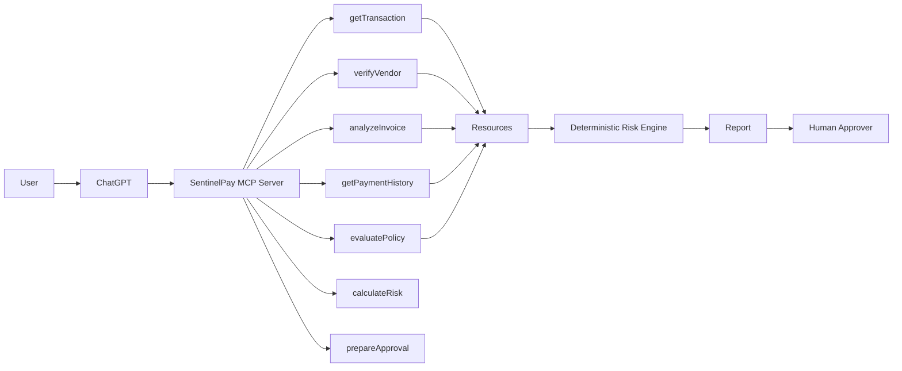
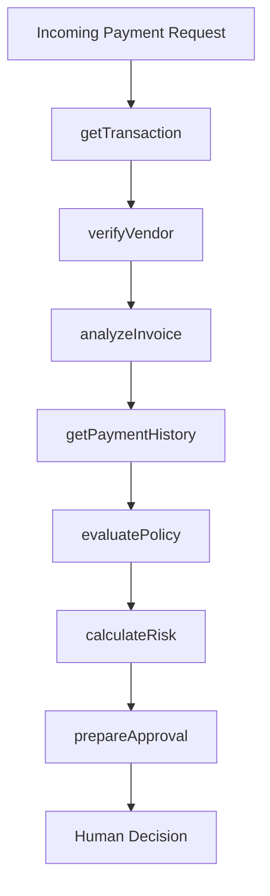
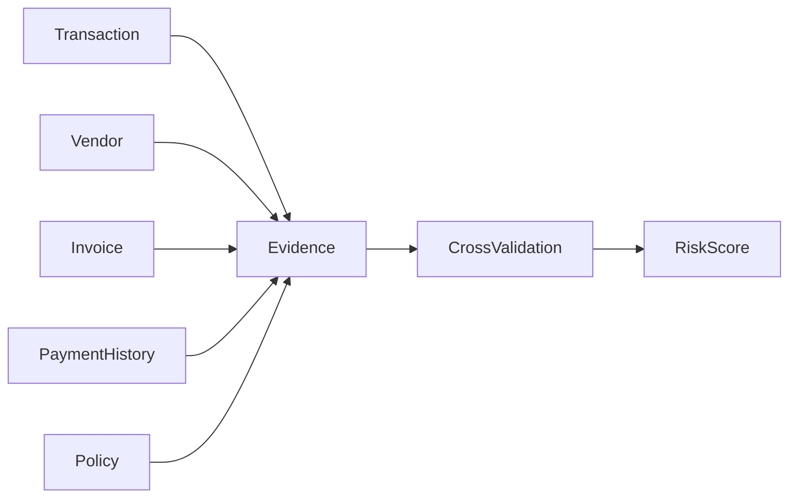
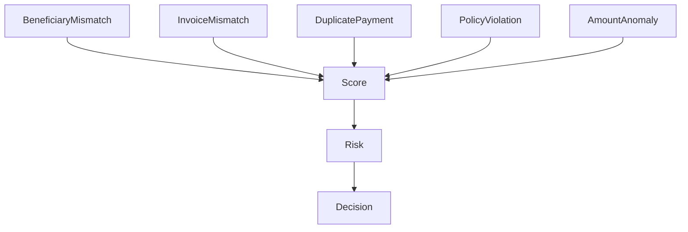
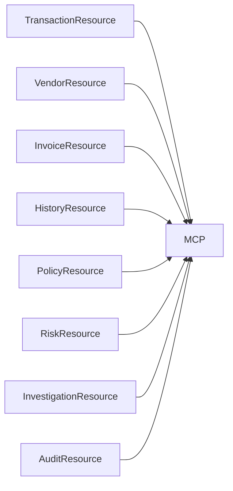
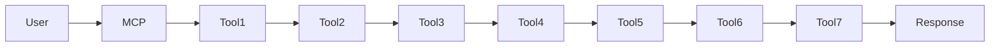
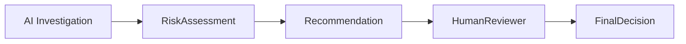

# SentinelPay-AI: Investigate. Verify. Explain. Approve.

> SentinelPay AI is an intelligent payment investigation assistant built to help financial teams detect fraud, reduce risk, and make faster, more informed paym…

  

**SentinelPay-AI: Investigate. Verify. Explain. Approve.** is an [MCP (Model Context Protocol)](https://nitrostack.ai) server that extends AI assistants — like Claude, Cursor, and any MCP-compatible client — with new, real-world capabilities. It is built and deployed on [Nitrostack](https://nitrostack.ai), the fastest way to build, deploy, and share MCP apps.

## Table of Contents

- [Overview](#overview)
- [What is MCP?](#what-is-mcp)
- [Features](#features)
- [Live Demo](#live-demo)
- [Getting Started](#getting-started)
- [Connect to an MCP Client](#connect-to-an-mcp-client)
- [Deploy Your Own MCP App](#deploy-your-own-mcp-app)
- [Explore More MCP Apps](#explore-more-mcp-apps)
- [FAQ](#faq)
- [Keywords](#keywords)
- [License](#license)

## Overview

SentinelPay AI is an intelligent payment investigation assistant built to help financial teams detect fraud, reduce risk, and make faster, more informed payment decisions. Instead of manually reviewing multiple systems and documents, users can interact with the platform using natural language to retrieve transaction details, verify vendors, analyze invoices, review payment history, evaluate policy compliance, assess financial risk, and generate approval recommendations. By combining structured financial data with AI-powered reasoning through the Model Context Protocol (MCP), SentinelPay AI simplifies complex investigation workflows, improves transparency, and helps organizations make consistent, explainable decisions while saving time and reducing operational overhead.

## What is MCP?

The **Model Context Protocol (MCP)** is an open standard that lets AI assistants securely connect to external tools, data sources, and services. Instead of being limited to what it was trained on, an AI model can call **MCP servers** to fetch live data, run actions, and integrate with real systems.

This project is one such MCP server. Learn more about building and shipping MCP apps at [nitrostack.ai](https://nitrostack.ai).

## Features

- 🔌 **MCP-native** — works with any MCP-compatible client (Claude, Cursor, and more)
- 🛠️ **Tools, resources & prompts** — exposes structured capabilities to AI agents
- ⚡ **Deployed on Nitrostack** — reliable, hosted, and instantly shareable
- 🔐 **Secure by design** — secrets stay in environment variables, never in code
- 🧩 **Composable** — combine with other MCP apps to build powerful AI workflows

## Live Demo

🚀 **Live MCP endpoint:** https://sentinelpay-ai-1-6a-fantastic-four-amrita-university-coimbatore.app.nitrocloud.ai

Point your MCP client at the endpoint above to try it instantly. Prefer a hosted setup? Deploy your own in minutes on [Nitrostack](https://nitrostack.ai).

## Getting Started

### Prerequisites

- Node.js 18+ (or your project runtime)
- An MCP-compatible client (Claude Desktop, Cursor, etc.)

### Installation

```bash
git clone https://github.com/your-username/your-mcp-project.git
cd sentinelpay-ai-investigate-verify-explain-approve
npm install
```

### Configuration

Copy the example environment file and add your own values:

```bash
cp .env.example .env
```

### Run

```bash
npm run start
```

## Connect to an MCP Client

Add this server to your MCP client configuration. A typical entry looks like:

```json
{
  "mcpServers": {
    "sentinelpay-ai-investigate-verify-explain-approve": {
      "url": "https://sentinelpay-ai-1-6a-fantastic-four-amrita-university-coimbatore.app.nitrocloud.ai"
    }
  }
}
```

Restart your client and the tools from this MCP server will be available to your AI assistant.

## Deploy Your Own MCP App

Want to build and ship an MCP server like this one? **[Nitrostack](https://nitrostack.ai)** lets you create, deploy, and host MCP apps in minutes — no infrastructure to manage.

👉 **Start building:** [https://nitrostack.ai](https://nitrostack.ai)

## Explore More MCP Apps

- 🌙 Discover and share MCP projects with the community on [r/mcptothemoon](https://www.reddit.com/r/mcptothemoon/)
- 🧰 Browse a growing catalog of MCP apps on [Nitrostack](https://nitrostack.ai/apps)

## FAQ

### What is an MCP server?

An MCP server implements the Model Context Protocol to expose tools, resources, and prompts that AI assistants can call. It lets an AI model take real actions and access live data.

### What does SentinelPay-AI: Investigate. Verify. Explain. Approve. do?

SentinelPay AI is an intelligent payment investigation assistant built to help financial teams detect fraud, reduce risk, and make faster, more informed paym…

### Which AI clients does this work with?

Any MCP-compatible client, including Claude Desktop and Cursor. New clients are adding MCP support regularly.

### How do I deploy my own MCP app?

Use [Nitrostack](https://nitrostack.ai) to build, deploy, and host MCP apps without managing infrastructure.

## Keywords

`BFSI & FinTech` · `SentinelPay-AI: Investigate. Verify. Explain. Approve.` · `MCP` · `Model Context Protocol` · `MCP server` · `MCP app` · `AI tools` · `AI agents` · `LLM tools` · `Claude MCP` · `Nitrostack` · `deploy MCP server` · `build MCP app`

# ⚙️ How SentinelPay Works

SentinelPay AI is built as a deterministic investigation assistant for payment operations. Instead of relying on an LLM to make financial decisions, every conclusion is produced through a sequence of specialized MCP tools. Each tool performs one well-defined task, gathers structured evidence, and passes its results to the next stage of the workflow.

This approach makes every investigation transparent, reproducible, and auditable. Rather than replacing human decision-makers, SentinelPay acts as an intelligent assistant that helps finance teams identify risks before payments are approved.

At no point does SentinelPay execute payments or authorize financial transactions. Its role is limited to investigation, evidence collection, policy evaluation, and generating recommendations for human review.

---

# 🏗️ System Architecture



---

# 🔄 End-to-End Workflow

Every investigation follows the exact same deterministic sequence to ensure consistency and explainability.



---

# 🔍 Investigation Pipeline

Each MCP tool contributes one specific piece of evidence.

| Step | MCP Tool | Purpose |
|------|----------|----------|
| 1 | getTransaction | Retrieve transaction metadata |
| 2 | verifyVendor | Validate beneficiary information |
| 3 | analyzeInvoice | Detect invoice inconsistencies |
| 4 | getPaymentHistory | Retrieve historical payment behavior |
| 5 | evaluatePolicy | Validate compliance policies |
| 6 | calculateRisk | Combine evidence into a deterministic risk score |
| 7 | prepareApproval | Generate an audit-ready approval package |

---

# 📊 Evidence Collection

Instead of depending on a single AI response, SentinelPay aggregates information from multiple independent sources before calculating risk.



Each evidence source remains independently verifiable, making every recommendation explainable and easy to audit.

---

# 🧠 Risk Assessment Pipeline

The deterministic risk engine combines multiple indicators into a single confidence score.



Typical risk indicators include:

- Beneficiary name mismatch
- Duplicate invoice detection
- Invoice inconsistencies
- Policy violations
- Unusual payment amounts
- Suspicious historical payment patterns

The final score determines whether a transaction is recommended for approval or requires manual investigation.

---

# 📁 MCP Resource Architecture



All resources are read-only and provide structured information to support the investigation process.

---

# 🤖 Tool Orchestration

The MCP server coordinates multiple independent tools while keeping each one responsible for a single task.



This modular architecture makes the platform easy to extend with additional investigation capabilities in the future.

---

# 🔒 Human Approval Boundary

SentinelPay is intentionally designed so that AI assists rather than replaces financial decision-makers.



The AI performs evidence collection, policy validation, and risk assessment, while the final approval always remains with an authorized human reviewer.

---

# 🛡️ Security Principles

SentinelPay follows a secure-by-design architecture.

- Authentication protects sensitive MCP tools.
- Read-only resources prevent accidental data modification.
- Every investigation follows a deterministic workflow.
- Audit reports capture all evidence used during analysis.
- No autonomous payment execution.
- Human approval is mandatory before any financial action.

---

# 🎯 Why MCP?

Rather than embedding business logic directly into an LLM, SentinelPay uses the **Model Context Protocol (MCP)** to expose deterministic tools and structured resources.

This architecture provides several advantages:

- Standardized tool interfaces
- Explainable execution
- Deterministic workflows
- Structured evidence retrieval
- Easy integration with enterprise systems
- Improved auditability
- Modular and extensible design

---

# 🚀 Future Roadmap

The current implementation demonstrates an end-to-end AI-assisted payment investigation workflow. Future enhancements may include:

- SAP integration
- Oracle ERP integration
- Microsoft Dynamics support
- Banking API connectivity
- OCR-based invoice extraction
- Real-time fraud detection
- Knowledge graph analysis for vendor relationships
- Adaptive machine learning risk scoring
- Case management dashboard
- Enterprise authentication (OAuth/SSO)
- Multi-tenant deployment
- Continuous compliance monitoring

---

# 📌 Key Design Principles

- **Explainability First** – Every recommendation is backed by verifiable evidence.
- **Deterministic Decisions** – Identical inputs always produce identical outputs.
- **Human-in-the-Loop** – AI assists; humans make final decisions.
- **Modular MCP Design** – Each tool has a single, clearly defined responsibility.
- **Security by Default** – Authentication and auditability are built into the platform.
- **Enterprise Ready** – Designed for integration with modern finance and ERP systems.

## License

MIT © 2026

---

Built with ❤️ using the Model Context Protocol on [Nitrostack](https://nitrostack.ai). Share your MCP app on [r/mcptothemoon](https://www.reddit.com/r/mcptothemoon/).

